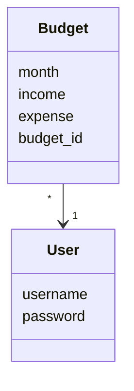
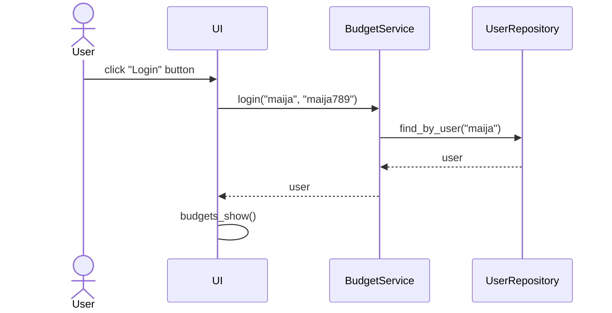
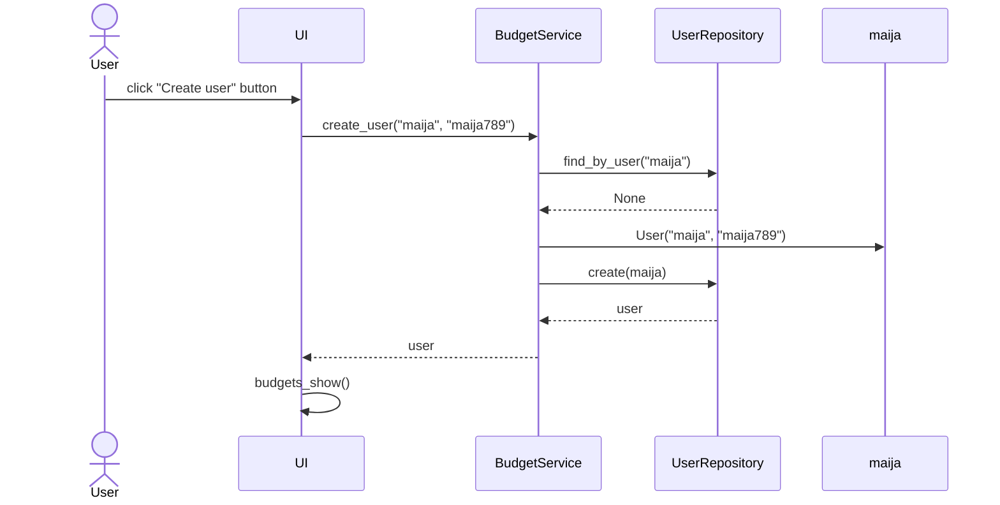
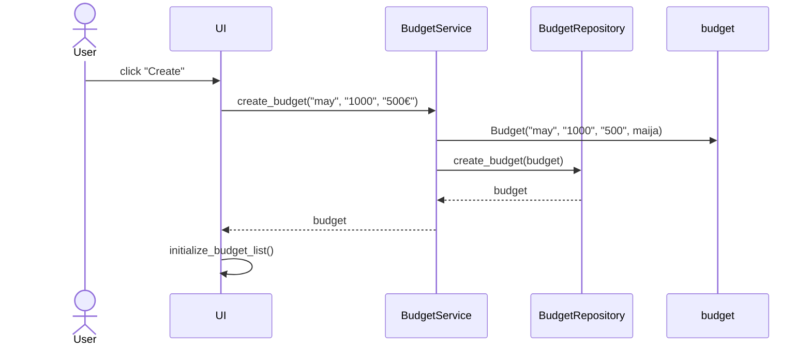

# Arkkitehtuurikuvaus

## Pakkausrakenne

## Sovelluslogiikka

Käyttäjiä ja käyttäjien budjetteja kuvaavat luokat User ja Budget:

## Päätoiminnallisuudet sekvenssikaavioina

### Kirjautuminen

### Käyttäjän luominen

### Budjetin luominen

