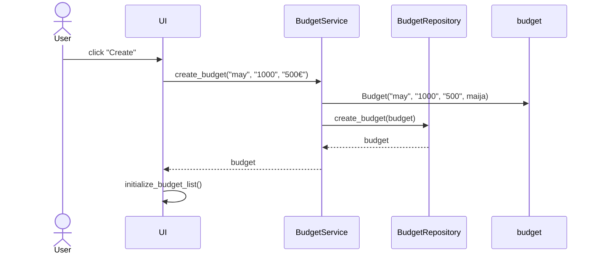

# Arkkitehtuuri

## Pakkausrakenne

## Sekvenssikaavio

### Budjetin luominen

```mermaid
sequenceDiagram
  actor User
  participant UI
  participant BudgetService
  participant BudgetRepository
  participant budget
  User->>UI: click "Create"
  UI->>BudgetService: create_budget("may", "1000", "500€")
  BudgetService->>budget: Budget("may", "1000", "500", maija)
  BudgetService->>BudgetRepository: create_budget(budget)
  BudgetRepository-->>BudgetService: budget
  BudgetService-->>UI: budget
  UI->>UI: initialize_budget_list()
```
