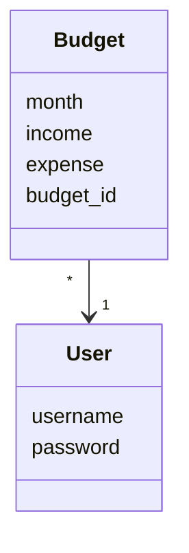
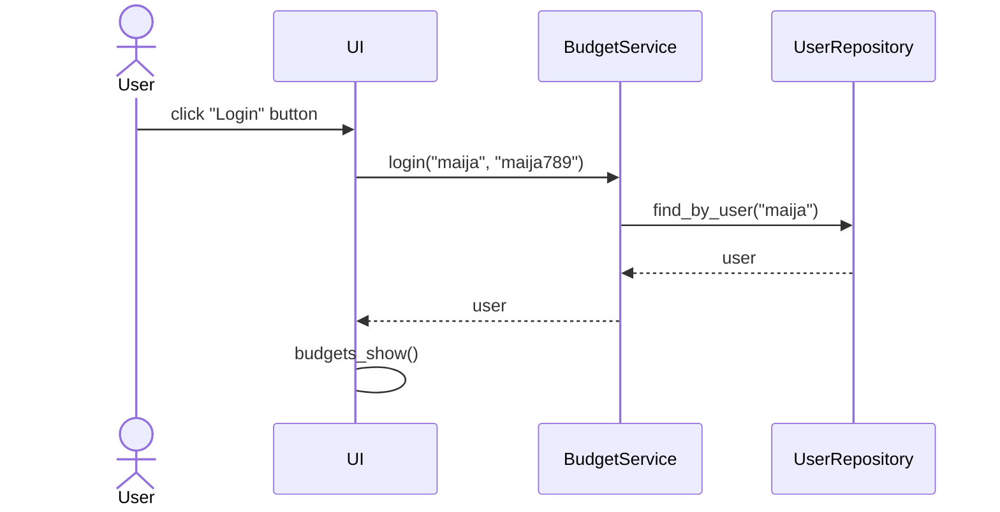
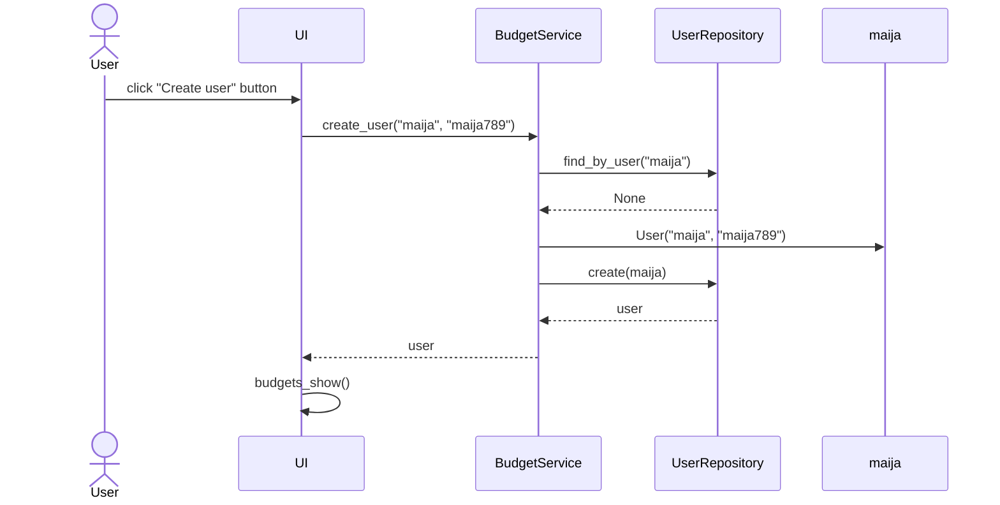
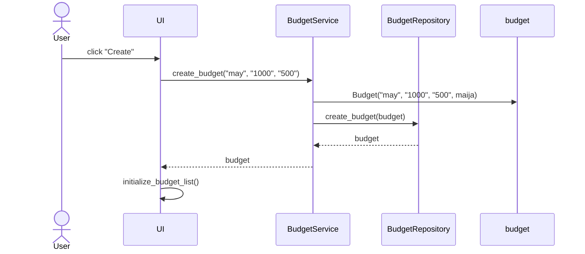

# Arkkitehtuurikuvaus

## Pakkausrakenne

Ohjelman koodin pakkausrakenne:


user_interface sisältää käyttöliittymästä vastaavan koodin, service siältää sovelluslogiikasta vastaavan koodin, repos sisältää tietojen pysyväistallennuksesta vastaavan koodin ja budget_user sisältää luokat Budget ja User.

## Käyttöliittymä

Käyttöliittymässä on kolme näkymää: kirjautuminen, uuden käyttäjän luominen ja budjettien listaus. Nämä näkymät on toteutettu omina luokkinaan ja näkymien 
näyttämisestä vastaa luokka UI. Vain yksi näkymä on kerrallaan näkyvänä.

## Sovelluslogiikka

Käyttäjiä ja käyttäjien budjetteja kuvaavat luokat User ja Budget:


Luokka BudgetService käyttää luokkia BudgetRepository ja UserRepository päästääkseen käyttämään käyttäjiä ja budjetteja. Käyttöliittymän toiminnoille luokka BudgetService tarjoaa omat metodit. 
Metodeja on esimerkiksi: 

```login(username, password)```

```create_budget(month, income, expense)```

```get_budgets()```

## Päätoiminnallisuudet sekvenssikaavioina

### Kirjautuminen

Kun käyttäjä syöttää kirjautumisnäkymän käyttäjätunnuksen ja salasanan ja painaa Login-painiketta, sovelluksen kontrolli menee näin:



### Käyttäjän luominen

Kun käyttäjä syöttää uuden käyttäjän luomisnäkymässä käyttäjätunnuksen ja salasanan ja painaa Create user-painiketta, sovelluksen kontrolli menee näin:



### Budjetin luominen

Kun käyttäjä syöttää budjettinäkymässä kuukauden, tulot ja menot, ja painaa Create-painiketta, sovelluksen kontrolli menee näin:



## Tietojen tallennus 

Luokat UserRepository ja BudgetRepository tallentavat tietoja SQLite-tietokantaan. Käyttäjät tallennetaan tauluun users ja budjetit tallennetaan tauluun budgets. Käyttäjien tallennukseen käytettävä taulu alustetaan initialize_database.py-tiedostossa ja budjettien tallennukseen käytettävä taulu alustetaan BudgetRepository-luokassa.
