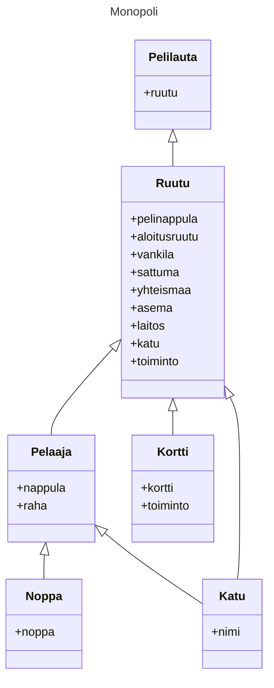

```mermaid
---
title: Monopoli
---
classDiagram
Pelilauta <|-- Ruutu
Ruutu <|-- Pelaaja
Pelaaja <|-- Noppa
Ruutu <|-- Kortti
Ruutu <|-- Katu
Pelaaja <|-- Katu
class Pelaaja{
  +nappula
  +raha
}
class Noppa{
  +noppa
}
class Pelilauta{
  +ruutu
}
class Ruutu{
  +pelinappula
  +aloitusruutu
  +vankila
  +sattuma
  +yhteismaa
  +asema
  +laitos
  +katu
  +toiminto
}
class Kortti{
  +kortti
  +toiminto
}
class Katu{
  +nimi
}
```
